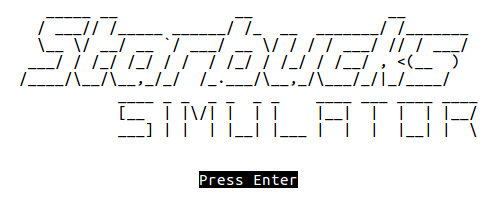
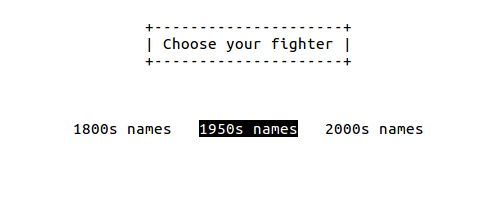
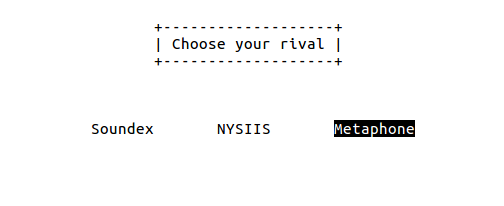
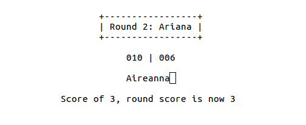

# Starbucks Simulator
A University of Alberta CMPUT 275 final project by Eric Claerhout (@imswebra) and Henry Lin (@heyitshenrylin).

|  |  |
| --- | --- |
|  |  |

## Project Overview
Starbucks Simulator is a game where users attempt to intentionally misspell randomly given names while maintaining their phonetic pronunciation, poking fun at the spelling done by Starbucks baristas. It features a full Ncurses UI, multiple name-sets to choose from, multiple phonetic indexing algorithms to play against, and three-round, timed gameplay, all loosely themed around classic arcade games such as Street Fighter II.

FIXME: Wikipedia links for the first entry of the algorithms.

The game itself serves as a showcase of the implemented algorithms, with score being the Damerau-Levenshtien distance between the given name and the user input. The catch, however, is that the two names must be phonetically identical according to the selected rival algorithm in order for the score to count. The unique properties of Soundex, NYSIIS, and Metaphone therefore serve as unique enemy behaviors, with Soundex, for example, not allowing the user to change the first letter of the name.

During each of the three rounds, the user is given a name to misspell in the 30 second time-limit. Multiple submissions are allowed, though only the best score from each round will be recorded. The final score is the sum of the three round scores.

## Included files
```
starbucksSimulator/
├── data/ (Directory for name list CSVs, sorted by years)
|	 ├── 1880s.csv
|	 ├── 1950s.csv
|	 └── 2000s.csv
├── obj/ (Directory for object output)
├── screenshots/ (Directory containing gameplay screenshots)
├── src/ (Directory containing source files)
|	 ├── algs/ (Directory for algorithm implementations)
|	 | 		├── levenshtein-distance.cpp
|	 | 		├── levenshtein-distance.h
|	 | 		├── metaphone.cpp
|	 | 		├── metaphone.h
|	 | 		├── nysiis.cpp
|	 | 		├── nysiis.h
|	 | 		├── soundex.cpp
|	 | 		└── soundex.h
|	 ├── gameController.cpp (Handles interaction between user and algorithms)
|	 ├── gameController.h
|	 ├── starbucksSimulator.cpp (Main program file)
|	 ├── strProcess.cpp (Collection of string processing functions)
|	 ├── strProcess.h
|	 ├── ui.cpp (Functions for every ncurses screen)
|	 ├── ui.h
|	 ├── uiHelper.cpp (Functions and classes to help with ui's functionality)
|	 └── uiHelper.h
├── Makefile
├── proposal.txt (Our original proposal)
└── README.md (This file)
```

## Running Instructions

### Compiling
The compiling computer must have the ncurses dev libraries installed, which can be added to the CMPUT 274 VM with 'sudo apt-get install libncurses5-dev'.

The project must then be compiled with g++ (not gcc) and must include the Ncurses library when linking ('-lncurses'), though both of these requirements are handled by the Makefile. The project can be compiled with 'make' or 'make starbucksSimulator', and can be cleaned with 'make clean'. The individual files can be compiled with 'make filename.o', though there shouldn't ever be a need as compiling the whole project will recompile any changed files.

The game can be run after it is compiled with './starbucksSimulator'.

### Controls and UI
After the title screen, the user can select the name-set to play with and the indexing algorithm to play against. In all menus, the left/right arrow keys are used to cycle through the options, with enter selecting the currently highlighted option. In addition, A/D keys can be used instead of left/right, or the 1-9 keys can be used to jump to a selection.

Following the selection screen, the first round will start after the ready screen. Below the round title is the timer followed by the current total score. After inputting a name, feedback will be given along the bottom of screen indicating whether the input's phonetic index matched the name's, and if so, if the score of that input was larger than the current best of the round.

The input supports uppercase and lowercase letters, hyphens, spaces, and apostrophes. Note that these latter three are simply for user understanding, and are stripped before any points calculations. Backspace and delete function as expected, as do the left/right arrow keys. Furthermore, support for ctrl-left/ctrl-right and home/end keys has also been added.

### Terminal Choice
Much of Ncurses' functionality relies on the functionality offered by the terminal being used. The UI has been built to try and limit this dependency on the chosen terminal, however the GNOME terminal (the VM's default) should be used to ensure compatibility.

Similarly, to resize the window, a system call of "resize -s 12 55" is used. Again, this is dependent on the current terminal application recognizing this command. That being said, should this command fail (or be removed), the UI is programmed to center itself horizontally and should still look nice. The only exception is when the terminal is being run fullscreen or in a maximized window, as Ubuntu's window manager is then taking control over the terminal's size.

## Known Bugs and Limitations
- Input is still accepted during the round transition screens despite no input box being shown.
- There is no formal mechanism in place to keep the user from being served the same name twice.
- The name datafiles are custom made, and they must contain one name per line and must be exactly 100 lines long with one empty line for the EOF character.
- Metaphone is not available in full pseudocode for free, as it requires a license. Instead, Michael Kuhn's implementation of the Metaphone from BASIC to C was used, as it has been released to the public. With proper crediting, our project modifies Kuhn's C code into usable C++ code.

# Sources
Phonetic algorithms based on the Wikipedia pseudocode:
- https://en.wikipedia.org/wiki/Soundex
- https://en.wikipedia.org/wiki/New_York_State_Identification_and_Intelligence_System

Michael Kuhn's implementation of Metaphone in C is available online at:
- http://aspell.net/metaphone/metaphone-kuhn.txt

Damerau-levenshtein distance calculation algorithm based from this Wikipedia pseudocode:
- https://en.wikipedia.org/wiki/Damerau%E2%80%93Levenshtein_distance

Other programming sources:
- posMod() in Choices class: https://stackoverflow.com/a/14997413
- removeChars() in strProcess: https://stackoverflow.com/a/5891643
- removeDuplicates() in strProcess: https://stackoverflow.com/a/27663803

The name lists created from this GitHub repo containing a csv of baby names:
- https://github.com/hadley/data-baby-names/blob/master/baby-names.csv
